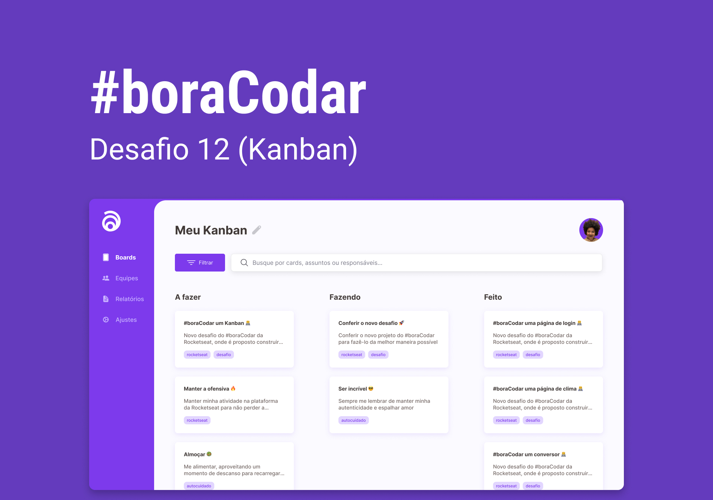

<h1 align="center"> Um Kanban </h1>

<a href="https://www.rocketseat.com.br/boracodar">#boraCodar</a> são desafios semanais, promovido pela Rocketseat para ensino de tecnologias WEB.  

  <a href="#-tecnologias">Tecnologias</a>&nbsp;&nbsp;&nbsp;|&nbsp;&nbsp;&nbsp;
  <a href="#layout">Layout</a>&nbsp;&nbsp;&nbsp;|&nbsp;&nbsp;&nbsp;
  <a href="#deploy">Deploy</a>&nbsp;&nbsp;&nbsp;|&nbsp;&nbsp;&nbsp;
  <a href="#memo-licença">Licença</a>

  

 

  

## 🚀 Tecnologias

Esse projeto foi desenvolvido com as seguintes tecnologias:

- HTML e CSS
- JavaScript e DOM
- Figma
- Responsividade

## Deploy

* [Deploy - Um Kanban](https://luisbarrichelloboracodardesafio12.netlify.app/) 

## 📚 O que pude aprender/revisar/praticar nesse desafio

- responsividade
- DOM: `querySelectorAll()`, `addEventListener`, `classList`, `window.location.href (identificar pagina atual)`, `currentTarget`

## 🔖 Layout

Você pode visualizar o layout do projeto através [DESSE LINK](https://www.figma.com/community/file/1220368226816658013). É necessário ter conta no [Figma](https://figma.com) para acessá-lo.

## :memo: Licença

Esse projeto está sob a licença MIT.
1